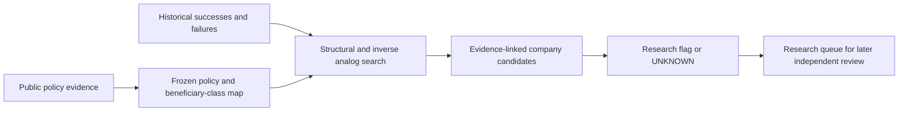

# ARGUS Power & Regulation Radar V0.1

Experimental research only. The Radar has no trading, portfolio-sizing, valuation, holdings, universe-onboarding, Core, Challenger or Observer write interface. Its only affirmative output is `REGULATORY_RESEARCH_FLAG`; incomplete records return `UNKNOWN`. Permitted follow-up kinds are `RESEARCH`, `REUNDERWRITE`, `ZERO_BASED_RESEARCH` and `HISTORICAL_ANALOG_REVIEW`.

Current pilot domains are fixed to AI infrastructure, energy/grid/power and defense/strategic industries. Historical research may span other industries to test structural analogies. Named companies are evidence-linked candidates, never a preconfigured beneficiary universe.

## Architecture

| File | Responsibility |
|---|---|
| `lib/regulatory-radar-model.js` | Versioned exact schemas; policy/participation/inference/economics distinctions; provenance and PIT validation |
| `lib/regulatory-radar-rules.js` | Fail-closed flags, component scoring, confidence gates, research-only output |
| `lib/regulatory-radar-transmission.js` | Ten-layer policy-to-economics path and ten second-order questions |
| `lib/regulatory-radar-history.js` | Versioned archetypes, historical successes, mixed outcomes and retained false positives |
| `lib/regulatory-radar-analogs.js` | Structural comparison, full-library ranking, inverse-case search; no keyword matching |
| `lib/regulatory-radar-validation.js` | Frozen retrospective T0 predictions and separate T+1/T+3/T+5 outcomes |
| `scripts/regulatory-radar-verify.mjs` | Six-path writer, exclusive writer lock, chain/source-hash verification, cross-record replay and protected-file checks |
| `scripts/regulatory-radar-run.mjs` | Read-only pilot replay by default; explicit guarded record ingestion |
| `scripts/regulatory-radar-history.mjs` | Read-only historical library/validation report |
| `tests/regulatory-radar.test.js` | Isolation, provenance, PIT, scoring, capture, analogy, historical and tampering regressions |
| `.github/workflows/regulatory-radar.yml` | Separate read-only CI; no crawler, write credentials, publication or promotion |

Six journals contain all persistent Radar state: `radar/events.jsonl`, `radar/patterns.jsonl`, `radar/historical-cases.jsonl`, `radar/analogs.jsonl`, `radar/validation.jsonl`, `radar/runs.jsonl`. An exclusive `.writer.lock` exists only during an append; it is concurrency metadata, not a research record. Each journal row hashes its sequence, previous hash and payload. Committed Git prefixes detect complete-record deletion/truncation as well as edits. A self-contained hash chain alone cannot prove that its tail was not removed; the committed anchor is required.

Every pre-existing tracked repository file is fingerprinted around writes. Only the six Radar journal destinations are allowed. Traversal, symlink/junction and hard-link destinations are rejected. Existing Core/Challenger/Observer functions are not imported; the only shared library is the pure canonicalization/freezing utility. These are enforced application boundaries, not a claim that arbitrary malicious Node.js code is OS-sandboxed.



There is no automatic queue write into Challenger or Core. A human may later submit a flag for independent Challenger investigation through existing governance. A Radar score never becomes a trade, portfolio weight or canonical valuation.

## Evidence and schema contract

Schemas are versioned `argus.regulatory-*/1`. Radar event payloads contain identity, jurisdiction, institution, policy type, dates, source inventory, sector/layer, policy mechanism and objective; all requested mechanism-specific fields; beneficiaries/losers/payer; participation fields; two-sided evidence; observed economics and revenue/margin/backlog/share/ROIC/FCF; competition, durability and risks; causality and evidence quality; transmission/second-order maps; company links; scoring inputs; confidence; unresolved fields and next research. Analogs and inverse cases are linked through the frozen mechanism hash to the versioned analog journal. Missing fields are explicit `UNKNOWN` values, not omitted or zero.

Claims are `VERIFIED_POLICY`, `VERIFIED_PARTICIPATION`, `INFERRED_TRANSMISSION`, `OBSERVED_ECONOMICS` or `RESEARCH_INTERPRETATION`, with source IDs. Verified policy requires a government policy source; public participation requires a participation source; observed capture requires operating/outcome evidence. A policy announcement cannot support a causal-study label. Unsupported intent is always `UNKNOWN` in V0.1; no mechanism attributes corruption, secret coordination or improper influence. Lobbying, association positions and standards participation remain UNKNOWN in this pilot because no qualifying participation record was captured.

Each source preserves URL, publication timestamp, observation timestamp, date precision, category, authority, edition, locator and a hash of the **curated factual excerpt**. These hashes do not claim to fingerprint the complete remote document. Government hosts are checked; issuer participation is reviewed against the cited issuer publication. There is no automated scraper or access-control bypass. The pilot used legitimate public government/issuer pages and documents through read-only research tools.

Date-only publications use the end of the stated UTC day as a conservative availability bound. Undated current pages keep publication time UNKNOWN and use their actual observation time as the earliest admitted availability; they cannot enter historical T0 reconstructions. Current sources must be published/available and observed by the cutoff. Retrospective sources must be dated government documents or archived publications available by the historical cutoff, while retaining their real modern observation time. Historical availability and modern retrieval are never conflated.

Company linkage follows a durable policy-class map. Companies can only be `POTENTIAL_BENEFICIARY` or, with operating evidence, `OBSERVED_RENT_CAPTURE`. The present candidates have no observed policy-attributed rent classification. A negative exposure can be investigated in the same research flag; inclusion is not an endorsement.

## Scoring and analog limits

`REGULATORY_RENT_SCORE` has ten equally weighted 0–4 components: magnitude, durability, bottleneck, entry barrier, concentration, actual capture, capital advantage, resistance to reversal, implementation and second-order capture. Component judgments require evidence and rationale. Zero is a supported adverse/absent judgment, never the default for UNKNOWN. The 0–100 aggregate is UNKNOWN if any component is missing. This pilot supplies only limited implementation judgments; it is not a calibrated prediction model.

`ANALOG_MATCH_SCORE` compares twelve explicitly reviewed economic categories: policy mechanism, industry structure, concentration, bottleneck, capital intensity, compliance cost, certification, supply elasticity, durability, political context, implementation and capture. Exact category matches score one; supported mismatches score zero; missing categories remain UNKNOWN. The numeric aggregate is withheld unless all twelve comparisons are known. Candidate retrieval uses the number of supported category matches with visible coverage, not titles, names, keywords or stock returns. Sparse-category ranking is an exploratory retrieval aid, not a probability or proof of causation.

Every search replays against the full eligible historical library at its capture time; omitted counterexamples and duplicate searches for the same frozen map are rejected. A failed case is preferred for inverse review, with mixed cases as fallback. Current evidence is required independently of similarity. High confidence additionally requires capture evidence, a complete rent score and an inverse case. Current flags are LOW confidence.

## Historical library and backward validation

Fifteen A–O archetypes encode the requested hypotheses and failure modes. Five researched cases provide initial evidence across 1978–2026 and transportation, materials, solar manufacturing and defense. This is a small seed library, not an exhaustive study of every suggested historical industry.

Rail and steel cases are limited successes: observed operating improvement or estimated price/output transfer. They do **not** establish universal company excess ROIC or durable economic rent. Solyndra is a documented false positive for the subsidy-recipient-as-durable-winner hypothesis. Airline deregulation and F-35 sustainment are mixed/inverse cases; customer outcomes must not be confused with supplier profit.

One Solyndra T0 reconstruction uses only the archived September 4, 2009 announcement, freezes the testable beneficiary hypothesis, then stores separate horizon results. It was created in 2026 with hindsight in case selection; it is **not a live 2009 forecast or unbiased prospective backtest**. T+1 lacks timely captured outcomes. T+3 and T+5 can establish the already-reported 2011 failure using September 2011 testimony; they do not invent 2012/2014 financial accounts. Horizon records are not independent cases. The false-positive rate remains UNKNOWN; at least ten measured cases are required even for a descriptive rate, and selected cases would still not establish population accuracy.

True-positive validation requires FCF or ROIC evidence in addition to a stated economic outcome; stock prices or revenue alone cannot establish durable rent. Missed second-order beneficiaries remain UNKNOWN unless identified with economic evidence. Solyndra's payments to suppliers/workers show a different recipient of spending, not proven supplier profit or an identified missed winner.

## Operating commands

```text
node scripts/regulatory-radar-verify.mjs <trusted-base-commit>
node scripts/regulatory-radar-run.mjs verify
node scripts/regulatory-radar-history.mjs
node scripts/regulatory-radar-run.mjs record <reviewed-input.json>
```

Record input is an array of `{journal, payload}` entries. Records append individually and fail closed; a rejected later record does not erase earlier valid entries. Source corrections require new records, not edits. The writer does no web fetching. Default runner/history commands and CI are read-only.

The pilot and integrity results below are generated from the journaled records, not a parallel mutable research database.


## Recorded historical cases

| Case | Result | Observed finding and limitation | Pattern | Primary sources |
|---|---|---|---|---|
| history-rail-1980 | SUCCESS_OBSERVED | Legal entry and physical access differ. Success means observed operating improvement, not proof of universal excess returns. | pattern-L, pattern-K | [rail](https://www.gao.gov/assets/a252479.html) |
| history-steel-2018 | SUCCESS_OBSERVED | Observed price/output transfer is a limited success; FCF, ROIC and persistence remain UNKNOWN. | pattern-I, pattern-N | [steel](https://www.usitc.gov/press_room/news_release/2023/er0315_63679.htm) |
| history-solyndra-2009 | REGULATORY_FALSE_POSITIVE | Volume, subsidy and financing cannot substitute for sustainable cost and cash economics. | pattern-B, pattern-K, pattern-M | [solar](https://www.energy.gov/ig/articles/special-report-11-0078-i); [testimony](https://www.energy.gov/congressional/articles/house-subcommittee-oversight-and-investigations) |
| history-airline-1978 | MIXED | Consumer benefits cannot be assumed to equal producer rent; firm FCF/ROIC were not established in this review. | pattern-L | [airline](https://www.gao.gov/assets/rced-96-79.pdf) |
| history-f35-2018 | MIXED | A customer outcome failure is not proof that a named contractor lost money; contractor rent remains UNKNOWN. | pattern-E, pattern-F | [f35](https://www.gao.gov/products/gao-24-106703) |

Historical case records retain every requested field; absent company margins, backlog, FCF, ROIC, valuations, lobbying and counterfactual outcomes remain UNKNOWN. No provider-level winner is invented from aggregate industry outcomes.

## Current pilot — AI_INFRASTRUCTURE

| Field | Research result |
|---|---|
| Policy event | Large-load tariff reform and cost allocation |
| Verified mechanism | Require grid operators to justify or reform large-load integration tariffs. |
| Cutoff | 2026-09-04T16:52:43.405Z |
| Transmission | Reform integration tariff → Assign connection behavior and costs → Grid infrastructure and engineering → Network access and equipment → Qualified engineering and equipment → Potential volume; pricing UNKNOWN → UNKNOWN → UNKNOWN → UNKNOWN → UNKNOWN |
| Potential direct beneficiary | Large-load developers and generation/interconnection providers, conditionally. |
| Potential second-order beneficiary | Grid equipment, switchgear and interconnection engineering suppliers. |
| Likely loser | Developers bear assigned connection costs; ratepayers remain exposed if safeguards fail. |
| Who pays | Large-load cost-recovery agreements; residual allocation depends on final tariffs. |
| Candidate company | GE Vernova — POTENTIAL_BENEFICIARY; GE Vernova describes data-center switchgear, substation equipment and interconnection consulting. Product participation is verified; policy-specific orders and margin capture are not. |
| Regulatory Rent Score | UNKNOWN; coverage 1/10; implementation 2/4 is a reviewed prioritization judgment, not economic capture. |
| Closest historical analog | history-rail-1980 |
| Second-best analog | history-airline-1978 |
| Analog Match Score | UNKNOWN; 5 supported matches; comparison coverage 6/12. |
| Similarities | mechanism, industryStructure, bottleneck, capitalIntensity, supplyElasticity |
| Material differences | implementation. Cross-industry business models, policy tools and customer economics also differ; unmeasured comparisons: concentration, complianceCost, certification, durability, politicalContext, capture |
| Historical beneficiary | Freight rail industry financial health improved; some shippers also benefited. |
| Historical unexpected/second-order beneficiary | UNKNOWN |
| Inverse analog | history-solyndra-2009 — Funded capacity and revenue growth failed to produce survival; subsidy-recipient-as-durable-winner hypothesis rejected. |
| Inverse limitations | Solyndra is a funded manufacturing failure, not a matched grid or certification experiment. It tests the funding/volume-to-profit leap; it does not predict the present outcome. |
| Evidence FOR | Require grid operators to justify or reform large-load integration tariffs. |
| Evidence AGAINST | Flexible transmission service may avoid upgrades; show-cause proceedings do not guarantee construction. |
| Causality quality | INFERRED; policy-to-company rent UNKNOWN. |
| Confidence | LOW |
| What must be true | A binding funded requirement must reach scarce suppliers with retained pricing and positive cash returns. |
| What would make the analogy fail today | Demand is cancelled, flexible service avoids equipment, projects stall, or new capacity removes scarcity. |
| Output | REGULATORY_RESEARCH_FLAG; no trading authority. |
| Exact UNKNOWN items | `event.effectiveDate`, `event.entryBarrierEffect`, `event.complianceCostEffect`, `event.subsidyMechanism`, `event.procurementMechanism`, `event.taxMechanism`, `event.tariffMechanism`, `event.reimbursementMechanism`, `event.exportControlMechanism`, `event.licensingMechanism`, `event.domesticContentMechanism`, `event.standardsMechanism`, `event.publicLobbyingEvidence`, `event.tradeAssociationEvidence`, `event.standardsParticipation`, `event.observedEconomics`, `event.revenueImpact`, `event.marginImpact`, `event.backlogImpact`, `event.marketShareImpact`, `event.roicImpact`, `event.fcfImpact`, `event.competitiveResponse`, `event.durability`, `event.reversibility`, `event.legalRisk`, `rent.magnitude`, `rent.durability`, `rent.bottleneck`, `rent.entryBarrier`, `rent.concentration`, `rent.actualCapture`, `rent.capitalAdvantage`, `rent.reversalResistance`, `rent.secondOrderCapture`, `analog.concentration`, `analog.complianceCost`, `analog.certification`, `analog.durability`, `analog.politicalContext`, `analog.capture`, `transmission.revenue`, `transmission.margins`, `transmission.fcfRoic`, `transmission.rentDuration`, `secondOrder.scarceCapacity`, `secondOrder.certificationOwner`, `secondOrder.ipOwner`, `secondOrder.mandatorySpendingRecipient`, `secondOrder.pricingPower`, `secondOrder.competitorCompliance`, `GE Vernova.bottleneck`, `GE Vernova.capacity`, `GE Vernova.competitors`, `GE Vernova.approvals`, `GE Vernova.certifications`, `GE Vernova.contracts`, `GE Vernova.customerConcentration`, `GE Vernova.revenueExposure`, `GE Vernova.backlogExposure`, `GE Vernova.marginEvidence`, `GE Vernova.fcfEvidence`, `GE Vernova.pricingPower` |
| Next research | HISTORICAL_ANALOG_REVIEW: Demand is cancelled, flexible service avoids equipment, projects stall, or new capacity removes scarcity. RESEARCH: Obtain final obligations, procurement awards, customer-level exposure and realized margins/FCF before claiming rent. |

Primary evidence and provenance:

- [ferc](https://www.ferc.gov/news-events/news/ferc-launches-aggressive-targeted-action-speed-large-load-integration): FERC issued six section 206 show-cause orders requiring regional grid operators to justify or reform large-load tariffs. Orders address cost recovery, load integration and consumer safeguards; final project awards and supplier profits are not established. Publication: 2026-06-18T23:59:59.999Z; observation: 2026-09-04T16:52:43.405Z; precision: DAY_END_BOUND; curated-excerpt SHA-256: `bcba5c13a2929b7ee339bb3d4240f4cdd1a15ca5a8f5801712172c26b6c65ec7`.
- [flexible](https://www.ferc.gov/news-events/news/commissioner-rosners-remarks-large-load-show-cause-orders-e-7-e-12-june-18-2026): Commissioner discussion explains cost-recovery protections and flexible service options that can avoid unnecessary grid upgrades; not every large load creates the same equipment demand. Publication: 2026-06-18T23:59:59.999Z; observation: 2026-09-04T16:52:43.405Z; precision: DAY_END_BOUND; curated-excerpt SHA-256: `bf7de211655f2a8040f0e5b58cdd3ffffd9c5605f6041c49b6705d2d236f9dd9`.
- [issuer](https://www.gevernova.com/electrification/industries/data-centers): GE Vernova describes data-center switchgear, substation equipment and interconnection consulting. Product participation is verified; policy-specific orders and margin capture are not. Publication: UNKNOWN; observation: 2026-09-04T16:52:43.405Z; precision: OBSERVATION_BOUND; curated-excerpt SHA-256: `f0d8e1c4289d946592f3083a01c59f785518f632bf52adf3f4e88d079c11ea5e`.

Frozen mechanism: `d60922f56ec612c107f3ea0793b3e970ede6e18019c6f70c9dc7ddd6fe98da26`. Final research event: `8f033f8edeadfdab52ccf5bbcebbca118004068ffb612532b23c08f585b370d7`. Named company mapping was appended after the mechanism and analog search. The latest final regulatory disposition, quantified exposure and demonstrated policy-attributed cash capture remain unverified where not supplied above.

## Current pilot — ENERGY_GRID_POWER

| Field | Research result |
|---|---|
| Policy event | Transformer standards RFI and DPA supply-chain context |
| Verified mechanism | Review standards alongside national-security equipment and core-steel capacity constraints. |
| Cutoff | 2026-09-04T16:52:43.405Z |
| Transmission | Review supply constraints and standards → Possible redesign and capacity spending → Transformer manufacturing → Qualified core materials and production → Approved materials and process know-how → Potential volumes; margins UNKNOWN → UNKNOWN → UNKNOWN → UNKNOWN → UNKNOWN |
| Potential direct beneficiary | Qualified transformer manufacturers; awards and amounts UNKNOWN. |
| Potential second-order beneficiary | Electrical core-steel, winding and specialized manufacturing-tool suppliers. |
| Likely loser | Utilities and ratepayers may fund higher equipment costs; noncompliant suppliers may need capital. |
| Who pays | Equipment purchasers, ratepayers and taxpayers if support is awarded. |
| Candidate company | Eaton — POTENTIAL_BENEFICIARY; Eaton announced $340m investment in three-phase transformer manufacturing, with production expected in 2027. Capacity addition is counterevidence to permanent scarcity; policy-specific returns are unproven. |
| Regulatory Rent Score | UNKNOWN; coverage 1/10; implementation 2/4 is a reviewed prioritization judgment, not economic capture. |
| Closest historical analog | history-solyndra-2009 |
| Second-best analog | history-steel-2018 |
| Analog Match Score | UNKNOWN; 4 supported matches; comparison coverage 5/12. |
| Similarities | mechanism, industryStructure, capitalIntensity, politicalContext |
| Material differences | implementation. Cross-industry business models, policy tools and customer economics also differ; unmeasured comparisons: concentration, bottleneck, complianceCost, certification, supplyElasticity, durability, capture |
| Historical beneficiary | A financed plant did not survive; no durable manufacturer rent demonstrated. |
| Historical unexpected/second-order beneficiary | Workers and suppliers received over $200m during the final financing interval; payments are not evidence of supplier profit. |
| Inverse analog | history-solyndra-2009 — Funded capacity and revenue growth failed to produce survival; subsidy-recipient-as-durable-winner hypothesis rejected. |
| Inverse limitations | Solyndra is a funded manufacturing failure, not a matched grid or certification experiment. It tests the funding/volume-to-profit leap; it does not predict the present outcome. |
| Evidence FOR | Review standards alongside national-security equipment and core-steel capacity constraints. |
| Evidence AGAINST | RFI is not funded procurement; materials flexibility and new capacity can dilute scarcity. |
| Causality quality | INFERRED; policy-to-company rent UNKNOWN. |
| Confidence | LOW |
| What must be true | A binding funded requirement must reach scarce suppliers with retained pricing and positive cash returns. |
| What would make the analogy fail today | No funded orders, relaxed requirements, alternative materials or rapid entry remove the putative rent. |
| Output | REGULATORY_RESEARCH_FLAG; no trading authority. |
| Exact UNKNOWN items | `event.effectiveDate`, `event.entryBarrierEffect`, `event.complianceCostEffect`, `event.subsidyMechanism`, `event.procurementMechanism`, `event.taxMechanism`, `event.tariffMechanism`, `event.reimbursementMechanism`, `event.exportControlMechanism`, `event.licensingMechanism`, `event.domesticContentMechanism`, `event.standardsMechanism`, `event.publicLobbyingEvidence`, `event.tradeAssociationEvidence`, `event.standardsParticipation`, `event.observedEconomics`, `event.revenueImpact`, `event.marginImpact`, `event.backlogImpact`, `event.marketShareImpact`, `event.roicImpact`, `event.fcfImpact`, `event.competitiveResponse`, `event.durability`, `event.reversibility`, `event.legalRisk`, `rent.magnitude`, `rent.durability`, `rent.bottleneck`, `rent.entryBarrier`, `rent.concentration`, `rent.actualCapture`, `rent.capitalAdvantage`, `rent.reversalResistance`, `rent.secondOrderCapture`, `analog.concentration`, `analog.bottleneck`, `analog.complianceCost`, `analog.certification`, `analog.supplyElasticity`, `analog.durability`, `analog.capture`, `transmission.revenue`, `transmission.margins`, `transmission.fcfRoic`, `transmission.rentDuration`, `secondOrder.scarceCapacity`, `secondOrder.certificationOwner`, `secondOrder.ipOwner`, `secondOrder.mandatorySpendingRecipient`, `secondOrder.pricingPower`, `secondOrder.competitorCompliance`, `Eaton.bottleneck`, `Eaton.capacity`, `Eaton.competitors`, `Eaton.approvals`, `Eaton.certifications`, `Eaton.contracts`, `Eaton.customerConcentration`, `Eaton.revenueExposure`, `Eaton.backlogExposure`, `Eaton.marginEvidence`, `Eaton.fcfEvidence`, `Eaton.pricingPower` |
| Next research | HISTORICAL_ANALOG_REVIEW: No funded orders, relaxed requirements, alternative materials or rapid entry remove the putative rent. RESEARCH: Obtain final obligations, procurement awards, customer-level exposure and realized margins/FCF before claiming rent. |

Primary evidence and provenance:

- [doe](https://www.govinfo.gov/content/pkg/FR-2026-06-15/pdf/2026-11971.pdf): DOE RFI reviews transformer efficiency standards against national-security supply constraints. It cites April 20 DPA determination covering transformers, core steel and other grid equipment. An RFI is not an award; 2024 standards have 2029 compliance timing. Publication: 2026-06-15T23:59:59.999Z; observation: 2026-09-04T16:52:43.405Z; precision: DAY_END_BOUND; curated-excerpt SHA-256: `dbe7a0713da1769dc7e152504af78c76da4e35adae1f2232b83ca990414836d7`.
- [standard](https://www.energy.gov/articles/doe-finalizes-energy-efficiency-standards-distribution-transformers-protect-domestic): DOE finalization announcement describes flexibility in materials and manufacturing for transformer efficiency standards. Compliance redesign is not proof of exclusive material supplier rents. Publication: 2024-04-04T23:59:59.999Z; observation: 2026-09-04T16:52:43.405Z; precision: DAY_END_BOUND; curated-excerpt SHA-256: `0ae7256d59bfd3fd7cba7c9173ac21114f002cf0beb9eb8c80082ae65bab2cff`.
- [issuer](https://www.eaton.com/us/en-us/company/news-insights/news-releases/2025/eaton-invests-in-new-south-carolina-transformer-manufacturing.html): Eaton announced $340m investment in three-phase transformer manufacturing, with production expected in 2027. Capacity addition is counterevidence to permanent scarcity; policy-specific returns are unproven. Publication: 2025-02-12T23:59:59.999Z; observation: 2026-09-04T16:52:43.405Z; precision: DAY_END_BOUND; curated-excerpt SHA-256: `46775a16d90f8e6db2bc17388cbf0ba3762eeadd2fec9c8c8bcf09c50cb06d12`.

Frozen mechanism: `a42a48e1fb41dced64a1b5e010623fe0e6af715d97a3267bcd76b400b32efde4`. Final research event: `24a662c414fe9dc75cc93fac7135843f17bf58cca2386fa3e6c9b22dec495f7a`. Named company mapping was appended after the mechanism and analog search. The latest final regulatory disposition, quantified exposure and demonstrated policy-attributed cash capture remain unverified where not supplied above.

## Current pilot — DEFENSE_STRATEGIC

| Field | Research result |
|---|---|
| Policy event | CMMC Phase II suspension with Phase I continuing |
| Verified mechanism | Suspend planned Phase II while preserving Phase I safeguards and procurement-specific requirements. |
| Cutoff | 2026-09-04T16:52:43.405Z |
| Transmission | Suspend Phase II; retain Phase I → Contract-specific compliance and self-assessment → Cybersecurity implementation and assessment → Authorized assessment capacity where required → Certification and qualified personnel → Demand direction mixed; pricing UNKNOWN → UNKNOWN → UNKNOWN → UNKNOWN → UNKNOWN |
| Potential direct beneficiary | Contractors may gain near-term assessment-cost relief; safeguards still cost money. |
| Potential second-order beneficiary | Security implementation providers may retain work; assessment-only vendors face delay risk. |
| Likely loser | Providers depending on the planned blanket Phase II assessment ramp. |
| Who pays | Defense contractors fund compliance; procurement pricing can shift cost to government. |
| Candidate company | Coalfire Federal — POTENTIAL_BENEFICIARY; Coalfire Federal announced Cyber AB C3PAO authorization. Authorization establishes participation, not current assessment demand or financial capture. |
| Regulatory Rent Score | UNKNOWN; coverage 1/10; implementation 1/4 is a reviewed prioritization judgment, not economic capture. |
| Closest historical analog | history-f35-2018 |
| Second-best analog | history-solyndra-2009 |
| Analog Match Score | UNKNOWN; 3 supported matches; comparison coverage 4/12. |
| Similarities | mechanism, industryStructure, certification |
| Material differences | implementation. Cross-industry business models, policy tools and customer economics also differ; unmeasured comparisons: concentration, bottleneck, capitalIntensity, complianceCost, supplyElasticity, durability, politicalContext, capture |
| Historical beneficiary | UNKNOWN |
| Historical unexpected/second-order beneficiary | UNKNOWN |
| Inverse analog | history-solyndra-2009 — Funded capacity and revenue growth failed to produce survival; subsidy-recipient-as-durable-winner hypothesis rejected. |
| Inverse limitations | Solyndra is a funded manufacturing failure, not a matched grid or certification experiment. It tests the funding/volume-to-profit leap; it does not predict the present outcome. |
| Evidence FOR | Suspend planned Phase II while preserving Phase I safeguards and procurement-specific requirements. |
| Evidence AGAINST | Suspension directly weakens an automatic certification-rent thesis; free public tools and self-assessments also compete. |
| Causality quality | INFERRED; policy-to-company rent UNKNOWN. |
| Confidence | LOW |
| What must be true | A binding funded requirement must reach scarce suppliers with retained pricing and positive cash returns. |
| What would make the analogy fail today | Self-assessments or program redesign replace paid assessment demand, or a reinstated mandate changes the negative case. |
| Output | REGULATORY_RESEARCH_FLAG; no trading authority. |
| Exact UNKNOWN items | `event.publicationDate`, `event.effectiveDate`, `event.entryBarrierEffect`, `event.complianceCostEffect`, `event.subsidyMechanism`, `event.procurementMechanism`, `event.taxMechanism`, `event.tariffMechanism`, `event.reimbursementMechanism`, `event.exportControlMechanism`, `event.licensingMechanism`, `event.domesticContentMechanism`, `event.standardsMechanism`, `event.publicLobbyingEvidence`, `event.tradeAssociationEvidence`, `event.standardsParticipation`, `event.observedEconomics`, `event.revenueImpact`, `event.marginImpact`, `event.backlogImpact`, `event.marketShareImpact`, `event.roicImpact`, `event.fcfImpact`, `event.competitiveResponse`, `event.durability`, `event.reversibility`, `event.legalRisk`, `rent.magnitude`, `rent.durability`, `rent.bottleneck`, `rent.entryBarrier`, `rent.concentration`, `rent.actualCapture`, `rent.capitalAdvantage`, `rent.reversalResistance`, `rent.secondOrderCapture`, `analog.concentration`, `analog.bottleneck`, `analog.capitalIntensity`, `analog.complianceCost`, `analog.supplyElasticity`, `analog.durability`, `analog.politicalContext`, `analog.capture`, `transmission.revenue`, `transmission.margins`, `transmission.fcfRoic`, `transmission.rentDuration`, `secondOrder.scarceCapacity`, `secondOrder.certificationOwner`, `secondOrder.ipOwner`, `secondOrder.mandatorySpendingRecipient`, `secondOrder.pricingPower`, `secondOrder.competitorCompliance`, `Coalfire Federal.bottleneck`, `Coalfire Federal.capacity`, `Coalfire Federal.competitors`, `Coalfire Federal.approvals`, `Coalfire Federal.contracts`, `Coalfire Federal.customerConcentration`, `Coalfire Federal.revenueExposure`, `Coalfire Federal.backlogExposure`, `Coalfire Federal.marginEvidence`, `Coalfire Federal.fcfEvidence`, `Coalfire Federal.pricingPower` |
| Next research | HISTORICAL_ANALOG_REVIEW: Self-assessments or program redesign replace paid assessment demand, or a reinstated mandate changes the negative case. RESEARCH: Obtain final obligations, procurement awards, customer-level exposure and realized margins/FCF before claiming rent. |

Primary evidence and provenance:

- [cmmc](https://www.defensesbirsttr.mil/Education/CMMC-Draft/): Official small-business guidance reports Phase II suspended effective July 13, 2026, with 60-day review. Phase I self-assessments and safeguarding obligations remain; some individual procurements can still require third-party assessments. Publication: UNKNOWN; observation: 2026-09-04T16:52:43.405Z; precision: OBSERVATION_BOUND; curated-excerpt SHA-256: `370c46b1839dddfd421102421b2861a7cacf6bc4fffa93d233d666016efa7654`.
- [issuer](https://coalfire.com/insights/news-and-events/press-releases/coalfire-federal-among-the-first-authorized): Coalfire Federal announced Cyber AB C3PAO authorization. Authorization establishes participation, not current assessment demand or financial capture. Publication: 2022-08-23T23:59:59.999Z; observation: 2026-09-04T16:52:43.405Z; precision: DAY_END_BOUND; curated-excerpt SHA-256: `53cef10a5920371b9b1bdca68a0b1cd0234f1fb12030828c0207618dd48beb85`.

Frozen mechanism: `2480bb445250795d2f0b4060236e10f5beaac37383cb1ea6788fc866b4decfc1`. Final research event: `15afe269e2bc6e764694d2882890a4ccb44363a682f92839e3c55d279934eabc`. Named company mapping was appended after the mechanism and analog search. The latest final regulatory disposition, quantified exposure and demonstrated policy-attributed cash capture remain unverified where not supplied above.

## Recorded backward validation

| Horizon | T0 hypothesis / actual outcome | Classification |
|---|---|---|
| T+1 | Financed manufacturer survival hypothesis / UNKNOWN. FCF and ROIC: UNKNOWN. | INSUFFICIENT_EVIDENCE |
| T+3 | Financed manufacturer survival hypothesis / Filed for bankruptcy in September 2011.. FCF and ROIC: UNKNOWN. | FALSE_POSITIVE |
| T+5 | Financed manufacturer survival hypothesis / Filed for bankruptcy in September 2011.. FCF and ROIC: UNKNOWN. | FALSE_POSITIVE |

Reconstructed cases: 1; descriptive false-positive rate: UNKNOWN. No confirmed missed named second-order beneficiary. No stock-price-only success classification.

## Verification and integrity

263 unit tests passed (213 existing +50 new), zero failures/skips; four browser suites passed; 63 application modules passed syntax checks. All 118 pre-existing tracked files are raw-byte identical to start commit `5ca672f5f5976dd7d9adb82c302fe11e45779040`, including all Core, Challenger, Observer, holdings, prices, baseline and proof artifacts. No existing repository file was modified. [Every before/after SHA-256 and journal head](REGULATORY_RADAR_INTEGRITY.json).

Journal records: events.jsonl=6, patterns.jsonl=15, historical-cases.jsonl=5, analogs.jsonl=3, validation.jsonl=4, runs.jsonl=1. No portfolio/trading authority exists in the record schemas or runner.
